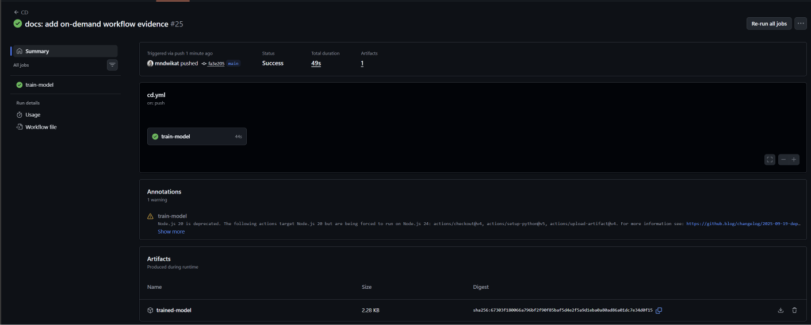

# Bike Sharing — Daily Demand Prediction (MLOps)

Predict the **daily number of bike rentals** (`cnt`) from weather and calendar
information, using a simple, interpretable regularized linear regression. The project
follows a full MLOps workflow: data preparation, experiment tracking with MLflow,
model selection, and CI/CD that retrains the model and serves batch predictions
automatically.

> **Dataset:** [Bike Sharing — UCI Machine Learning Repository](https://archive.ics.uci.edu/dataset/275/bike+sharing+dataset) (`day.csv`, 731 daily records).

**Contents**

1. [Problem Statement & Analysis](#1-problem-statement--analysis)
2. [Model Development](#2-model-development)
3. [Conclusions](#3-conclusions)
4. [Project structure](#project-structure) · [How to run it locally](#how-to-run-it-locally)

---

## 1. Problem Statement & Analysis

### The problem

Bike-sharing operators need to anticipate **how many bikes will be rented on a given
day** in order to plan fleet distribution, maintenance and staffing. We build a model
that predicts the total daily demand from information that is known *in advance*
(season, calendar and weather forecast), so the prediction can be used for next-day
planning.

### Problem type

This is a **regression** problem: the target `cnt` (total bikes rented that day) is a
continuous count, and we predict a numeric value rather than a class.

### How the data is obtained, and from where

- **Source:** the **Bike Sharing dataset** from the **UC Irvine Machine Learning
  Repository**.
- **Format & ingestion:** a **static CSV file** (`datasets/raw/day.csv`, 731 daily
  records covering 2011–2012). The data is read in **batch** — there is no live API
  call. The raw file is versioned in the repository so every training run is fully
  reproducible.
- **Target:** `cnt` — total bikes rented that day.
- **Features used (11):** `season`, `yr`, `mnth`, `holiday`, `weekday`,
  `workingday`, `weathersit`, `temp`, `atemp`, `hum`, `windspeed`.
- **Dropped columns:** `instant` (row id), `dteday` (date, already represented by
  `yr`, `mnth`, `weekday`), and `casual` + `registered`. The last two are dropped
  because `casual + registered == cnt` for every row, so using them would be **data
  leakage**.

### System design decisions

| Decision | Choice | Why |
|---|---|---|
| **Data ingestion** | Static CSV, read in batch | The dataset is a fixed historical file; batch loading keeps runs reproducible and simple. |
| **Latency allowed** | **Relaxed — batch / on-demand, not real-time** | Daily demand is predicted for *planning*, not for a live user request. Training the full 731-row dataset and producing batch predictions both take **seconds**, which is far inside any acceptable window. We therefore optimize for **reproducibility, correctness and maintainability**, not inference speed. (The chosen linear model is lightweight, so sub-millisecond single-row inference would be possible if it were ever served behind an API — but that is not a current requirement.) |
| **Feature engineering location** | Inside a single scikit-learn `Pipeline` | The saved model accepts the **raw 11 columns** directly, which avoids train/serve skew and makes prediction trivial. |
| **Model family** | Regularized **linear** models | Per the course guidance, we avoid overly complex models and prefer an interpretable baseline that performs well. |
| **Reproducibility** | Fixed `random_state=42`, pinned dependency versions | Anyone (including the professor) gets the same split, the same model and the same metrics. |
| **Experiment tracking** | MLflow | Every model is logged as a run with its parameters and metrics for comparison. |
| **Automation** | GitHub Actions: CI, CD, on-demand | CI checks pull requests, CD retrains on push to `main`, and an on-demand workflow produces batch predictions. |

---

## 2. Model Development

### 2.1 Data preparation and feature engineering

The raw dataset (`datasets/raw/day.csv`, 731 daily records) is cleaned and transformed
before training. All transformations live **inside a single scikit-learn `Pipeline`**,
so the saved model accepts the raw 11 columns directly:

| Feature group | Columns | Transformation |
|---|---|---|
| Categorical | `season`, `mnth`, `weekday`, `weathersit` | One-hot encoding |
| Binary | `yr`, `holiday`, `workingday` | Left as-is (already 0/1) |
| Continuous | `temp`, `atemp`, `hum`, `windspeed` | Polynomial features (degree 2: squares + interactions) |

The polynomial terms let a linear model capture non-linear effects (e.g. demand rises
with temperature but drops on extremely hot days).

A cleaned snapshot of the data (the 11 features + `cnt`, after dropping the unused
columns) is also written to `datasets/processed/processed_day.csv` for traceability.

### 2.2 Validation strategy

The data is split **70% / 15% / 15%** into train / validation / test
(`random_state=42`):

- **Train (70%)** — fit each model.
- **Validation (15%)** — choose the best model and the best regularization strength
  (`alpha`).
- **Test (15%)** — final, unbiased evaluation of the chosen model (used only once).

We report **three metrics**: **RMSE** (primary, lower is better), **MAE**, and **R²**.

### 2.3 Models compared (MLflow)

Three linear models are compared, each logged as an MLflow run. For Ridge and Lasso,
the best `alpha` is selected from `[0.01, 0.1, 1, 10, 100]` on the validation set.

| Model | Validation RMSE | Validation MAE | Validation R² |
|---|---|---|---|
| LinearRegression | 3898 | 850 | -2.655 |
| Ridge (alpha=0.01) | 699 | 494 | 0.883 |
| **Lasso (alpha=0.1)** | **698** | **494** | **0.883** |


*Figure 1. Validation RMSE and R² for the three models. The plain LinearRegression
collapses (negative R²) while the regularized models perform well.*

The three runs are logged in MLflow, each with its parameters (model, alpha) and
metrics (val_rmse, val_mae, val_r2):


*Figure 2. The three runs registered in MLflow. LinearRegression is unstable with the
polynomial features (negative R²), while Ridge and Lasso both reach R² ≈ 0.88. Lasso
(alpha = 0.1) had the lowest validation RMSE and was selected.*

### 2.4 Chosen model and key finding

**Selected model: Lasso** (alpha = 0.1), the lowest validation RMSE.

**Key finding — why regularization matters here:** once the polynomial features are
added, the plain `LinearRegression` becomes unstable and overfits, producing a
**negative R² (-2.655)** — it predicts worse than simply guessing the mean. With many
correlated features (e.g. `temp` and `atemp` and their polynomial terms), the
unregularized model assigns huge, unstable weights. Ridge and Lasso penalize large
weights, stay stable, and improve the result. This is a textbook justification for
using regularization.

### 2.5 Final performance (test set)

The chosen model (Lasso) is retrained on train + validation (85%) and evaluated once on
the untouched test set:

- **Test RMSE ≈ 667 bikes/day** (better than the validation RMSE, indicating no
  overfitting).

With an average demand of ~4500 rentals/day, this is roughly a 15% typical error — a
strong result for a simple, interpretable linear model.

### 2.6 MLOps workflows

The project includes three GitHub Actions workflows: **CI**, **CD**, and **on-demand
prediction**.

**CI workflow.** Runs when a pull request is opened against `main`. It installs the
dependencies and checks that the main Python files compile correctly, catching simple
errors before merging.

**CD workflow.** Runs on push to `main`. It installs the dependencies and runs
`python main.py`, which retrains the model and generates `models/best_model.pkl`. The
trained model is published as a GitHub Actions artifact.



*Figure 3. A successful CD run on push to `main`: the `train-model` job retrains the
model and publishes `best_model.pkl` as a build artifact.*

**On-demand prediction workflow.** Triggered manually (`workflow_dispatch`). It first
trains the model, then runs `python predict.py`, which reads
`batch_prediction_dataset/on_demand_dataset.csv` and writes
`batch_prediction_dataset/predictions.csv` with an added `predicted_cnt` column.


*Figure 4. A successful on-demand run: the `batch-prediction` job trains the model,
generates the predictions, and uploads `predictions.csv` as an artifact.*


*Figure 5. The resulting `predictions.csv`, with the appended `predicted_cnt` column
holding the predicted daily demand for each input row.*

---

## 3. Conclusions

**What we built.** A reproducible, end-to-end MLOps pipeline that predicts daily
bike-sharing demand from calendar and weather information. The pipeline covers data
cleaning and feature engineering (inside a single scikit-learn `Pipeline`), experiment
tracking with MLflow, automatic model selection, and CI/CD plus an on-demand batch
prediction workflow on GitHub Actions.

**Final results.** Three linear models were compared on a 70/15/15 split. The plain
`LinearRegression` was unstable once polynomial features were added, while the
regularized models were strong. **Lasso (alpha = 0.1)** was selected for the lowest
validation RMSE and achieved a **test RMSE ≈ 667 bikes/day** with **R² ≈ 0.88** — about
a 15% typical error against an average demand of ~4500 rentals/day.

**Key takeaway.** The most important lesson of the project is *why regularization
matters*: with many correlated, high-degree features, an unregularized linear model
overfits and collapses to a negative R², whereas Ridge and Lasso stay stable and
generalize well. A simple, interpretable model — properly regularized — is enough to
get a strong, trustworthy result here.

**Limitations.**

- The dataset is small (731 daily records, 2011–2012) and static, so the model does not
  see recent trends or special events.
- Daily granularity only; intra-day demand patterns are not modeled.
- The model family is linear; genuinely non-linear interactions beyond degree-2
  polynomials are not captured.
- Hyperparameter tuning is limited to an `alpha` grid for Ridge/Lasso.

**Future work.**

- Use the hourly dataset (`hour.csv`) for finer-grained demand prediction.
- Compare against tree-based models (e.g. Random Forest, Gradient Boosting) as a
  non-linear benchmark.
- Add automated retraining on fresh data and a model registry for versioning.
- Serve the model behind an API with monitoring and data-drift detection.

---

## Project structure

```
bike-sharing-mlops/
├── datasets/
│   ├── raw/day.csv                  # raw daily data (source of truth)
│   └── processed/processed_day.csv  # cleaned snapshot (regenerated on training)
├── notebooks/
│   └── 01_eda.ipynb                 # exploratory data analysis
├── src/
│   ├── config.py                    # shared paths, target, feature lists
│   ├── data_preprocessing.py        # load data + feature engineering
│   └── train.py                     # model comparison + MLflow + save best model
├── models/
│   └── best_model.pkl               # trained pipeline (created by training)
├── batch_prediction_dataset/
│   ├── on_demand_dataset.csv        # sample input for batch prediction
│   └── predictions.csv              # prediction output (created by predict.py)
├── report/
│   └── images/                      # charts and MLflow / workflow screenshots
├── .github/workflows/               # CI / CD / on-demand prediction
├── main.py                          # entry point: runs the training
├── predict.py                       # batch prediction script
└── requirements.txt
```

## How to run it locally

```bash
# 1. install dependencies
pip install -r requirements.txt

# 2. train the model (creates models/best_model.pkl and MLflow runs)
python main.py

# 3. run a batch prediction (creates batch_prediction_dataset/predictions.csv)
python predict.py

# 4. (optional) open the MLflow UI to see the experiments
mlflow ui
```
