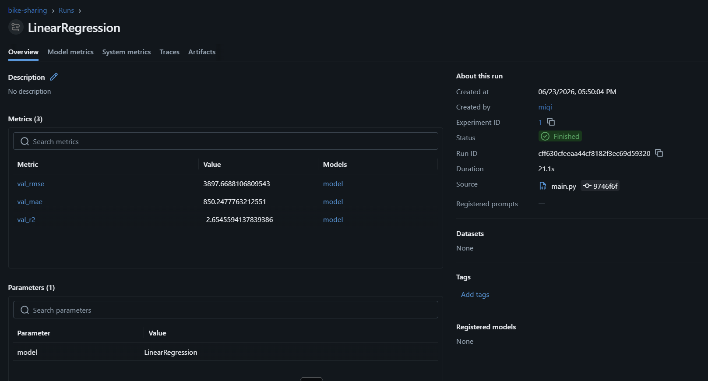
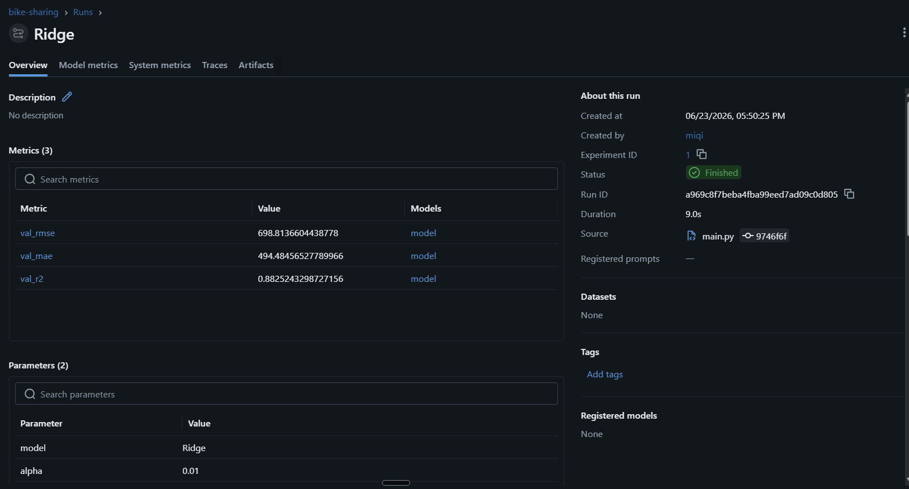
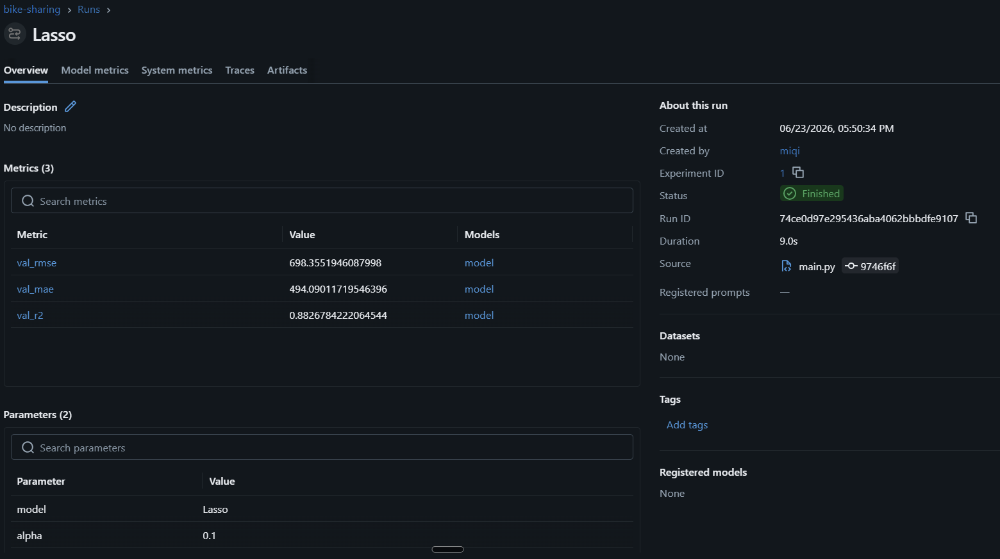

# 3. Model Development

## 3.1. Data preparation and feature engineering

The raw dataset (`datasets/raw/day.csv`, 731 daily records) was cleaned and transformed before training:

- **Dropped columns:** `instant` (row id), `dteday` (date, already represented by `yr`, `mnth`, `weekday`), and `casual` + `registered`. The last two are dropped because `casual + registered == cnt` for every row, so using them would be data leakage.
- **Target:** `cnt` (total daily bike rentals).
- **Features (11):** `season`, `yr`, `mnth`, `holiday`, `weekday`, `workingday`, `weathersit`, `temp`, `atemp`, `hum`, `windspeed`.

Transformations (all inside a single scikit-learn `Pipeline`, so the saved model accepts the raw 11 columns directly):

| Feature group | Columns | Transformation |
|---|---|---|
| Categorical | `season`, `mnth`, `weekday`, `weathersit` | One-hot encoding |
| Binary | `yr`, `holiday`, `workingday` | Left as-is (already 0/1) |
| Continuous | `temp`, `atemp`, `hum`, `windspeed` | Polynomial features (degree 2: squares + interactions) |

The polynomial terms let a linear model capture non-linear effects (e.g. demand rises with temperature but drops on extremely hot days).

## 3.2. Validation strategy

The data was split **70% / 15% / 15%** into train / validation / test (`random_state=42`):

- **Train (70%)** — fit each model.
- **Validation (15%)** — choose the best model and the best regularization strength (`alpha`).
- **Test (15%)** — final, unbiased evaluation of the chosen model (used only once).

We report three metrics: **RMSE** (primary, lower is better), **MAE**, and **R²**.

## 3.3. Models compared (MLflow)

Three linear models were compared, each logged as an MLflow run. For Ridge and Lasso, the best `alpha` was selected from `[0.01, 0.1, 1, 10, 100]` on the validation set.

| Model | Validation RMSE | Validation MAE | Validation R² |
|---|---|---|---|
| LinearRegression | 3898 | 850 | -2.655 |
| Ridge (alpha=0.01) | 699 | 494 | 0.883 |
| **Lasso (alpha=0.1)** | **698** | **494** | **0.883** |

*Figure 1. Validation RMSE and R² for the three models. The plain LinearRegression collapses (negative R²) while the regularized models perform well.*

The following screenshots show each run logged in MLflow, with its parameters (model, alpha) and metrics (val_rmse, val_mae, val_r2).

*Figure 2. LinearRegression run in MLflow: val_r2 = -2.65 (the model is unstable with the polynomial features).*

*Figure 3. Ridge run in MLflow (alpha = 0.01): val_rmse = 698.8, val_r2 = 0.883.*

*Figure 4. Lasso run in MLflow (alpha = 0.1): val_rmse = 698.4, val_r2 = 0.883. This is the selected model.*

## 3.4. Chosen model and key finding

**Selected model: Lasso** (alpha = 0.1), the lowest validation RMSE.

**Key finding — why regularization matters here:** once the polynomial features are added, the plain `LinearRegression` becomes unstable and overfits, producing a **negative R² (-2.655)** — it predicts worse than simply guessing the mean. With many correlated features (e.g. `temp` and `atemp` and their polynomial terms), the unregularized model assigns huge, unstable weights. Ridge and Lasso penalize large weights, stay stable, and improve the result. This is a textbook justification for using regularization.

## 3.5. Final performance (test set)

The chosen model (Lasso) was retrained on train + validation (85%) and evaluated once on the untouched test set:

- **Test RMSE ≈ 667 bikes/day** (better than the validation RMSE, indicating no overfitting).

With an average demand of ~4500 rentals/day, this is roughly a 15% typical error — a strong result for a simple, interpretable linear model.
