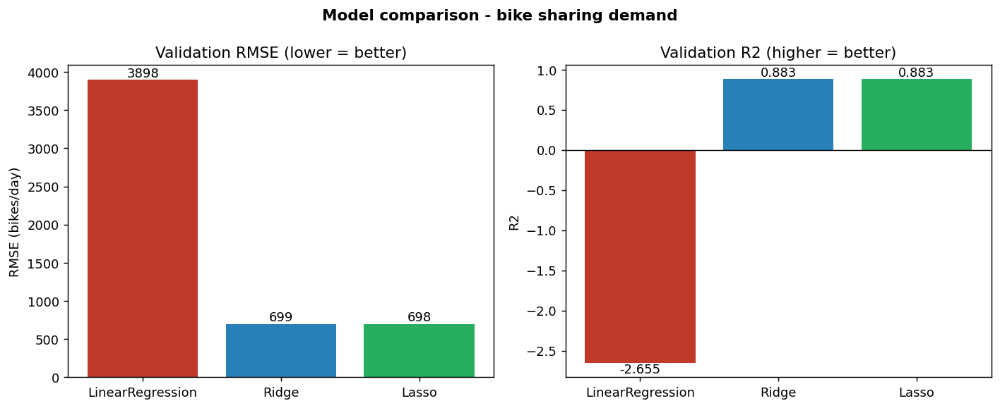
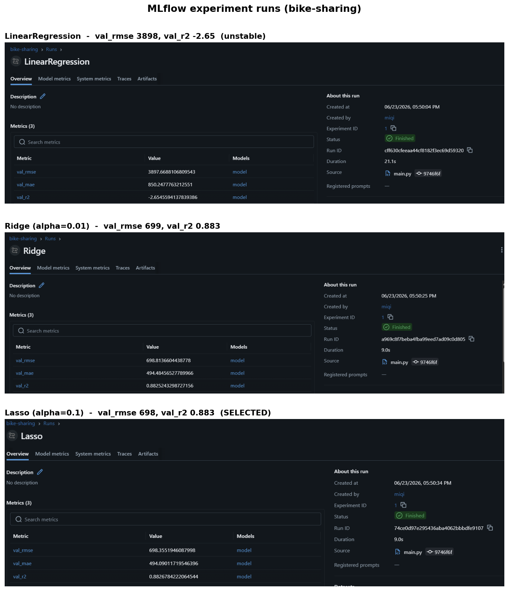
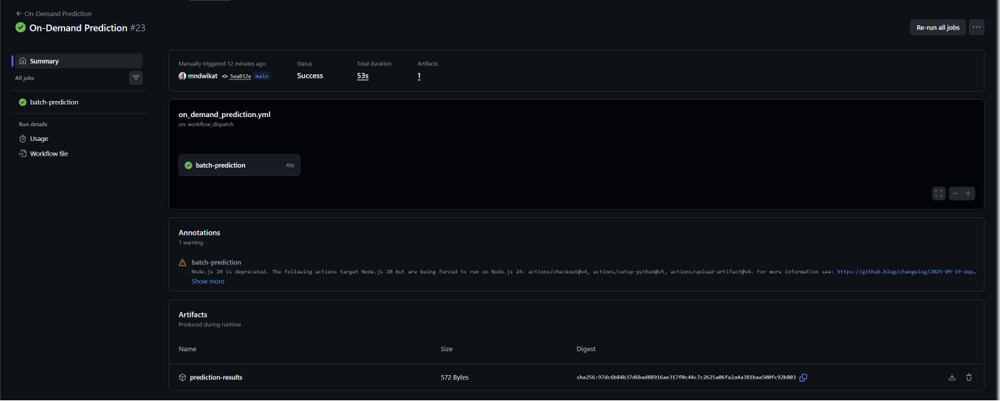
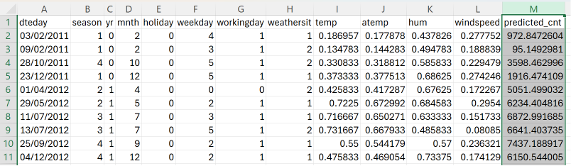

# 3. Model Development

## 3.1. Data preparation and feature engineering

The raw dataset (`datasets/raw/day.csv`, 731 daily records) was cleaned and transformed before training:

- **Dropped columns:** `instant` (row id), `dteday` (date, already represented by `yr`, `mnth`, `weekday`), and `casual` + `registered`. The last two are dropped because `casual + registered == cnt` for every row, so using them would be data leakage.
- **Target:** `cnt` (total daily bike rentals).
- **Features (11):** `season`, `yr`, `mnth`, `holiday`, `weekday`, `workingday`, `weathersit`, `temp`, `atemp`, `hum`, `windspeed`.

Transformations (all inside a single scikit-learn `Pipeline`, so the saved model accepts the raw 11 columns directly):

| Feature group | Columns | Transformation |
|---|---|---|
| Categorical | `season`, `mnth`, `weekday`, `weathersit` | One-hot encoding |
| Binary | `yr`, `holiday`, `workingday` | Left as-is (already 0/1) |
| Continuous | `temp`, `atemp`, `hum`, `windspeed` | Polynomial features (degree 2: squares + interactions) |

The polynomial terms let a linear model capture non-linear effects (e.g. demand rises with temperature but drops on extremely hot days).

## 3.2. Validation strategy

The data was split **70% / 15% / 15%** into train / validation / test (`random_state=42`):

- **Train (70%)** — fit each model.
- **Validation (15%)** — choose the best model and the best regularization strength (`alpha`).
- **Test (15%)** — final, unbiased evaluation of the chosen model (used only once).

We report three metrics: **RMSE** (primary, lower is better), **MAE**, and **R²**.

## 3.3. Models compared (MLflow)

Three linear models were compared, each logged as an MLflow run. For Ridge and Lasso, the best `alpha` was selected from `[0.01, 0.1, 1, 10, 100]` on the validation set.

| Model | Validation RMSE | Validation MAE | Validation R² |
|---|---|---|---|
| LinearRegression | 3898 | 850 | -2.655 |
| Ridge (alpha=0.01) | 699 | 494 | 0.883 |
| **Lasso (alpha=0.1)** | **698** | **494** | **0.883** |

*Figure 1. Validation RMSE and R² for the three models. The plain LinearRegression collapses (negative R²) while the regularized models perform well.*

The three runs were logged in MLflow, each with its parameters (model, alpha) and metrics (val_rmse, val_mae, val_r2):

*Figure 2. The three runs registered in MLflow. LinearRegression is unstable with the polynomial features (negative R²), while Ridge and Lasso both reach R² ≈ 0.88. Lasso (alpha = 0.1) had the lowest validation RMSE and was selected.*

## 3.4. Chosen model and key finding

**Selected model: Lasso** (alpha = 0.1), the lowest validation RMSE.

**Key finding — why regularization matters here:** once the polynomial features are added, the plain `LinearRegression` becomes unstable and overfits, producing a **negative R² (-2.655)** — it predicts worse than simply guessing the mean. With many correlated features (e.g. `temp` and `atemp` and their polynomial terms), the unregularized model assigns huge, unstable weights. Ridge and Lasso penalize large weights, stay stable, and improve the result. This is a textbook justification for using regularization.

## 3.5. Final performance (test set)

The chosen model (Lasso) was retrained on train + validation (85%) and evaluated once on the untouched test set:

- **Test RMSE ≈ 667 bikes/day** (better than the validation RMSE, indicating no overfitting).

With an average demand of ~4500 rentals/day, this is roughly a 15% typical error — a strong result for a simple, interpretable linear model.

## 3.6. MLOps workflows

The project includes three GitHub Actions workflows: CI, CD, and on-demand prediction.

### CI workflow

The CI workflow runs when a pull request is opened against the main branch. It installs the project dependencies and checks that the main Python files compile correctly. This helps us catch simple code errors before merging changes into main.

### CD workflow

The CD workflow runs when changes are pushed to the main branch. It installs the dependencies and runs:

`python main.py`

This retrains the model and generates the trained model file:

`models/best_model.pkl`

The trained model is uploaded as a GitHub Actions artifact.

### On-demand prediction workflow

The on-demand workflow is triggered manually from GitHub Actions. It first trains the model, then runs:

`python predict.py`

The prediction script reads the input file:

`batch_prediction_dataset/on_demand_dataset.csv`

It then creates the output file:

`batch_prediction_dataset/predictions.csv`

The output file includes a new column called `predicted_cnt`, which contains the predicted daily bike rental demand.

